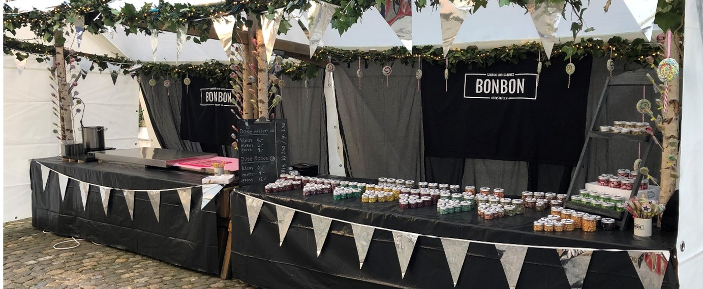

+++
title = "Die Bonbon-Werkstatt – Wo warmer Zucker in warme Herzen verwandelt wird"
date = "2023-06-15"
draft = false
pinned = false
+++
## **Zwei Lostorferinnen ist es gelungen, die traditionelle Kunst der Bonbonherstellung in eine neue Verpackung zu bringen, die fast so einzigartig ist wie die Süssigkeiten selbst.**

##### Inmitten des Buochser Quais, besetzt vom Trubel des Jahrmarktes, sticht ein Stand hervor, dessen bezaubernd süsser Duft das Herz eines jeden Naschkatzen höherschlagen lässt: Sandras und Sabines Bonbon-Werkstatt. Gemeinsam ist es den beiden passionierten Bonbonmacherinnen gelungen, das traditionelle Handwerk der Bonbonherstellung mit zeitgemässer Unterhaltung zu verbinden und damit die Aufmerksamkeit zahlreicher Marktbesucher auf sich zu ziehen. Es herrscht eine Atmosphäre, in der die Magie der Bonbonherstellung förmlich spürbar ist.

**Grosse Dinge beginnen oft klitzeklein**

Schon seit ihrer frühen Schulzeit seien die beiden Lostorferinnen Sandra Hunziker und Sabine Hoffmann eng befreundet. Auf einer gemeinsamen Reise hätten sie das Handwerk kennengelernt und sich anschliessend dazu entschieden, die Kunst der Bonbonproduktion zu erlernen. Bei einer Befragung gibt Frau Hunziker von sich, dass Sabine Hoffmann ein vierwöchiges Praktikum in Oberhausen, in der Nähe von Köln, absolviert habe, während sie selbst einen Lehrgang in Augsburg besucht habe. Anschliessend hätten sie ihr erlangtes Wissen gemeinsam in die Praxis umsetzen wollen. «Grosse Dinge beginnen oft klitzeklein», meint Frau Hunziker und erzählt weiter, dass die Produktion ihren Anfang in Sabine Hoffmanns Keller genommen habe. Erst im Laufe der Zeit sei den beiden klar geworden, dass sie einen neuen Ort brauchten, um ihre Träume zu verwirklichen. Am Muttertag 2020 durchschnitten sie schliesslich das Band für ihren kleinen Laden in der Zofinger Altstadt.

**Magische Momente**

Sandras und Sabines Bonbon-Werkstatt ist aber nicht nur ein Ort, an dem Bonbons hergestellt werden, sondern auch ein Ort, an dem besondere Momente geschaffen werden. Seit einigen Jahren bieten die beiden verschiedenste Workshops und Veranstaltungen an, bei denen die Zuschauer die Bonbonproduktion live miterleben oder sogar selbst mitmachen können. "Egal ob Firmenanlass, ein Geburtstag oder eine Eröffnungsfeier, mit den farbigen Süssigkeiten wird jeder Event unvergesslich", heisst es auf ihrer Website. Es entstünde so nicht nur die Möglichkeit, solche Veranstaltungen mit einem süssen Erlebnis zu bereichern, sondern auch die Möglichkeit für die beiden Frauen, die Teilnehmer mit ihrer Freude an der Bonbonherstellung anzustecken, erzählt Frau Hunziker auf Nachfrage.

**Die bunten Farben des Marktes** 

Von lokalen Landwirten und leidenschaftlichen Kunsthandwerkern bis hin zu mitreissender Unterhaltung und erstklassigen kulinarischen Angeboten - der Buochser Quai-Markt bietet alles. Es ist ein Ort, an dem Menschen mit den unterschiedlichsten Hintergründen zusammenkommen, um ihre eigenen Produkte zu präsentieren und die der anderen zu bestaunen. Auch Sandras und Sabines Bonbon-Werkstatt findet am 13. Mai 2023 in diesem bunten Treiben ihren Platz. 

Die Live-Aufführung der Bonbonproduktion ist zweifellos der Höhepunkt des Marktbesuchs. Die Besucher sind eingeladen, in eine Welt voller Farben, Geschmacksrichtungen und faszinierenden Techniken einzutauchen. Schritt für Schritt können Zuschauer den ganzen Prozess der Bonbonherstellung beobachten: vom kristallinen Zucker bis hin zu der fertigen Leckerei. Dabei wird von den Bonbonmacherinnen immer ganz genau erklärt, was sie tun und worauf man dabei achten muss. Sie geben aber nicht nur ihr Wissen und ihre Leidenschaft für das Handwerk weiter, sondern beantworten auch geduldig die Fragen der Umstehenden und es entsteht eine einzigartige Verbindung zwischen den Besuchern und der Kunst der Bonbonherstellung. Laut Frau T. Oppliger, einer begeisterten Kundin der Live-Show, sei es unglaublich, wie die Bonbonmacherinnen den Zucker in die kleinen farbigen Bonbons verwandeln – sie habe so etwas noch nie zuvor vor Ort mitverfolgen können. Weiter äusserte sie sich, dass man förmlich spüren könne, wie viel Liebe und Leidenschaft in jedes einzelne Bonbon gesteckt wird und wie viel Erfahrung dahinterstecke.

**Ein Freund fürs Leben**

Auf dem Markt lässt sich unter anderem sehen, wie die beiden Frauen der Bonbon-Werkstatt Kissen-Bonbons, in allen möglichen Geschmacksrichtungen und Farben, herstellen! Nach dem Zuckerkochen und Zuckerfärben formen sie ein einziges grosses, buntes Bonbon und dieses wird dann zu Stangen gezogen. Dann werden diese Stangen, mit einer ganz antik wirkenden Bonbonmaschine, zu Kissen gepresst werden - Anton. «Damit wir Bonbonkissen nach traditioneller Handwerkskunst herstellen können, hat Toni für uns eine Bonbonmaschine mit modernster 3D-Drucktechnik nachgebaut», schreiben sie auf ihrer Webseite. Diese Bonbonmaschine wird Anton genannt und laut Frau Hoffmann sei Anton sozusagen der dritte Mitarbeiter des Unternehmens. «Egal wohin wir gehen, Anton begleitet uns», ergänzt Frau Hunziker ihre Aussage mit einem breiten Lächeln im Gesicht.

**Zwischen Tradition und Kreativität**

Die Bonbonmanufaktur bewahrt zwar den Charme traditioneller Herstellungstechniken, wie z. B. die Durchführung der einzelnen Arbeitsschritte von Hand und den Einsatz der altehrwürdigen Bonbonmaschine, lässt aber auch Raum für Kreativität und Innovation. Neben klassischen Geschmacksrichtungen wie Erdbeere, Zitrone und Minze überrascht Sandras und Sabines Bonbon-Werkstatt ihre Besucher regelmässig mit exotischen Geschmacksrichtungen wie Lavendel-Zitronengras oder Kaktusfeige. Diese einzigartige Kombination aus Tradition und Kreativität macht die Bonbonmanufaktur zu einem wahren Unikat und ist auch der Grund dafür, dass der Kundenkreis des Unternehmens so gross ist.

**Der süsse Genuss**

Natürlich sind solche Veranstaltungen aber nicht nur da, um den Zuschauern das Wasser im Mund zusammenlaufen zu lassen. Das Angebot reicht von den verschiedensten Farben und Formen bis hin zu den unterschiedlichsten Geschmacksrichtungen und Grössen. Kissenbonbons, Lollis und «Rocks» sind der Ausgangspunkt und ob Cola, Kaktusfeige, Vanille oder Bubblegum, es gibt sie in wirklich allen Geschmacksrichtungen, die das Herz begehrt! "Unsere Bonbons sind alle vegan, fettfrei, laktosefrei und glutenfrei", gibt Frau Hoffmann im Laufe der Live-Show von sich, und somit ist klar, dass es ausnahmslos für jeden etwas im Sortiment hat.

**Ein Blick in die Zukunft**

Sandras und Sabines Bonbon-Werkstatt hat bereits einen grossen Erfolg erzielt, sowohl in ihrem Geschäft als auch als Eventanbieter. Das heisst aber nicht, dass sich die beiden Frauen jetzt auf ihren Lorbeeren ausruhen. Ganz im Gegenteil, verrät Hunziker: «Wir sind konstant auf der Suche nach Verbesserungen und planen, unser Sortiment in Zukunft um neue Aromen und Produkte zu erweitern.» Auch ihre Live-Show wollen sie verbessern und ein interaktiveres Erlebnis für die Besucher schaffen – Ihre Erfolgsreise ist also noch lange nicht zu Ende und es lässt sich hoffen, dass die Bonbon-Werkstatt, mit ihrer einzigartigen Kombination aus traditionellem Handwerk und moderner Unterhaltung, die den Prozess der Bonbonherstellung wahrhaftig zum Leben erwecken lässt, auch in Zukunft die Herzen vieler Menschen erobern und weiterhin eine ganz besondere Atmosphäre und ein wahres Kleinod auf den Schweizer Märkten bieten wird.

*Autorin: Ria Sharma*